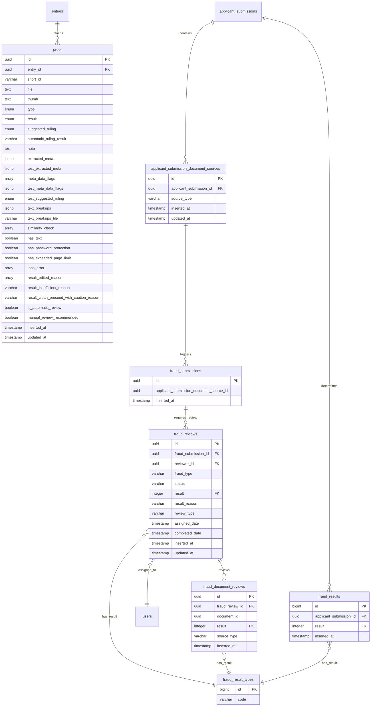
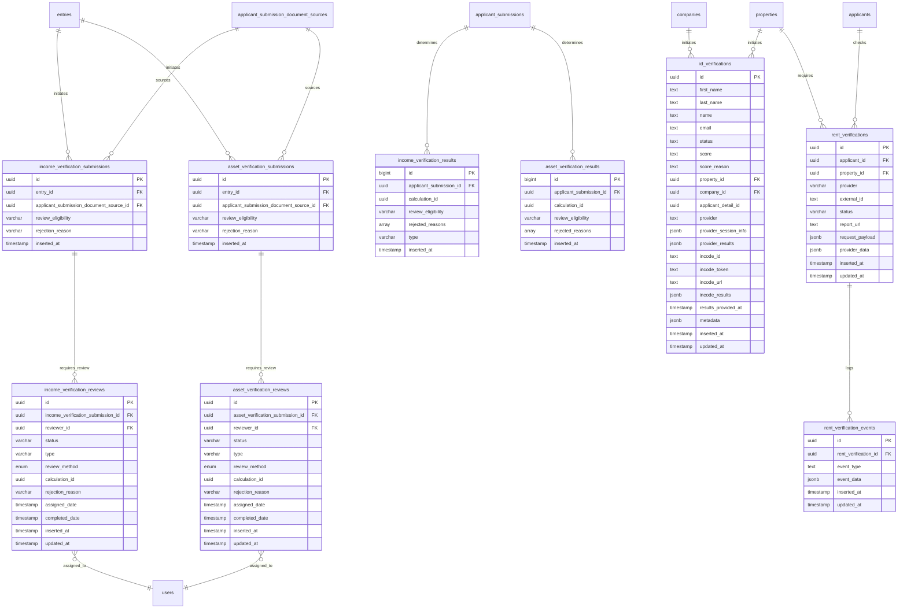

# Comprehensive Schema Reference - All 30 Documented Tables

**Generated:** 2025-11-25
**Database:** fraud_postgresql (Production)
**Tables Documented:** 30 tables with complete column details
**Version:** 1.0

---

## Overview

This document provides a complete detailed view of all 30 documented tables with every column for in-depth reference and understanding. Each table includes:

- ✅ Every column with complete data types
- ✅ All foreign key relationships
- ✅ Primary keys marked with PK
- ✅ Foreign keys marked with FK
- ✅ Special types (enums, jsonb, arrays, tsvector)
- ✅ Composite keys marked with FK_PK

**Note:** For workflow-focused views and business logic, see [ERD_DIAGRAMS.md](ERD_DIAGRAMS.md) Sections 1-4.

---

## How to View These Diagrams

These diagrams use Mermaid syntax, which renders automatically in:
- GitHub (when viewing this file in a repository)
- GitLab
- Many markdown editors (VS Code with Mermaid extension)
- [Mermaid Live Editor](https://mermaid.live/) (paste the diagram code)

---

## Table of Contents

1. [Part 1: Core Entities & Users (14 tables)](#part-1-core-entities--users-14-tables)
2. [Part 2: Fraud Detection & Document Management (7 tables)](#part-2-fraud-detection--document-management-7-tables)
3. [Part 3: Verification Workflows (9 tables)](#part-3-verification-workflows-9-tables)
4. [Usage Guide](#usage-guide)

---

## Part 1: Core Entities & Users (14 Tables)

**Tables Included:**
- companies, properties, folders, entries
- applicants, applicant_details, applicant_submissions
- owners, property_owners
- users, team, role, users_properties, users_owners

**Purpose:** Complete organizational hierarchy, applicant management, and access control model.

```mermaid
erDiagram
    %% Core Entity Hierarchy
    companies ||--o{ properties : "manages"
    companies ||--o{ users : "employs"
    companies ||--o{ folders : "owns"
    properties ||--o{ folders : "contains"
    folders ||--o{ entries : "groups"
    entries ||--o{ applicants : "screens"
    applicants ||--o{ applicant_submissions : "submits"
    applicants }o--o| applicant_details : "has_details"

    %% Access Control
    properties ||--o{ users_properties : "grants_access"
    users ||--o{ users_properties : "has_access"
    owners ||--o{ property_owners : "owns"
    properties ||--o{ property_owners : "owned_by"
    users ||--o{ users_owners : "manages"
    owners ||--o{ users_owners : "managed_by"
    users }o--|| companies : "works_for"
    users }o--|| team : "belongs_to"
    team }o--o| users : "managed_by"

    companies {
        uuid id PK
        varchar name
        varchar address
        varchar city
        varchar state
        varchar zip
        varchar phone
        varchar website
        varchar logo
        varchar short_id
        varchar salesforce_account_id
        timestamp inserted_at
        timestamp updated_at
    }

    properties {
        uuid id PK
        varchar name
        varchar entity_name
        varchar address
        varchar city
        varchar state
        varchar zip
        varchar phone
        varchar email
        varchar website
        varchar logo
        varchar short_id
        integer unit
        uuid company_id FK
        varchar company_short_id
        varchar pmc_name
        varchar status
        varchar sfdc_id
        integer bank_statement
        integer paystub
        jsonb supported_doctypes
        boolean unit_is_required
        boolean phone_is_required
        boolean identity_verification_enabled
        varchar identity_verification_provider
        jsonb identity_verification_flow_types
        jsonb identity_verification_report_image_types
        tsvector textsearchable_index_col
        timestamp inserted_at
        timestamp updated_at
    }

    folders {
        uuid id PK
        varchar name
        varchar status
        varchar result
        varchar dynamic_ruling
        timestamp ruling_time
        uuid property_id FK
        uuid company_id FK
        varchar property_short_id
        varchar property_name
        varchar company_short_id
        uuid last_entry_id FK
        timestamp last_entry_submission_time
        varchar last_entry_result
        varchar last_entry_status
        uuid review_assigned_to_id FK
        timestamp review_assigned_date
        timestamp inserted_at
        timestamp updated_at
    }

    entries {
        uuid id PK
        varchar short_id
        varchar status
        varchar result
        enum suggested_ruling
        text note
        varchar unit
        jsonb metadata
        uuid folder_id FK
        timestamp submission_time
        timestamp report_complete_time
        varchar notification_email
        boolean has_previously_submitted
        boolean auto_merged
        boolean is_automatic_review
        varchar review_status
        timestamp review_date
        timestamp review_assigned_date
        uuid reviewer_id FK
        uuid review_assigned_to_id FK
        timestamp primary_notification_sent_at
        timestamp secondary_notification_sent_at
        timestamp twenty_two_hours_notification_sent_at
        timestamp sixteen_hours_notification_sent_at
        timestamp inserted_at
        timestamp updated_at
    }

    applicants {
        uuid id PK
        varchar full_name
        varchar first_name
        varchar middle_initial
        varchar last_name
        varchar email
        varchar phone
        boolean notification
        uuid entry_id FK
        uuid applicant_detail_id FK
        uuid identity_id
        timestamp inserted_at
        timestamp updated_at
    }

    applicant_details {
        uuid id PK
        jsonb prefilled_application_data
        timestamp inserted_at
        timestamp updated_at
    }

    applicant_submissions {
        uuid id PK
        uuid applicant_id FK
        timestamp submitted_time
        uuid identity_id
        boolean should_notify_applicant
        timestamp inserted_at
        timestamp updated_at
    }

    owners {
        uuid id PK
        varchar name
        varchar address
        varchar city
        varchar state
        varchar zip
        varchar phone
        varchar website
        varchar salesforce_id
        varchar status
        timestamp inserted_at
        timestamp updated_at
    }

    property_owners {
        uuid id PK
        uuid property_id FK
        uuid owner_id FK
        timestamp ownership_start
        timestamp ownership_end
        timestamp inserted_at
        timestamp updated_at
    }

    users {
        uuid id PK
        uuid auth_id
        varchar short_id
        varchar first_name
        varchar last_name
        varchar email
        varchar role
        uuid company_id FK
        uuid team_id FK
        boolean settings_notification
        boolean is_archived
        timestamp inserted_at
        timestamp updated_at
    }

    team {
        uuid id PK
        varchar name
        varchar timezone
        integer country_id FK
        uuid fde_manager_id FK
        timestamp inserted_at
        timestamp updated_at
    }

    role {
        bigint id PK
        varchar name
    }

    users_properties {
        bigint id PK
        uuid user_id FK
        uuid property_id FK
        timestamp inserted_at
        timestamp updated_at
    }

    users_owners {
        uuid owner_id FK_PK
        uuid user_id FK_PK
        timestamp inserted_at
        timestamp updated_at
    }
```

---

## Part 2: Fraud Detection & Document Management (7 Tables)

**Tables Included:**
- proof, applicant_submission_document_sources
- fraud_submissions, fraud_reviews, fraud_document_reviews
- fraud_results, fraud_result_types

**Purpose:** Complete document upload flow, ML/AI fraud analysis, human review workflow, and final fraud determination.

---

## Part 3: Verification Workflows (9 Tables)

**Tables Included:**
- Income: income_verification_submissions, income_verification_reviews, income_verification_results
- Asset: asset_verification_submissions, asset_verification_reviews, asset_verification_results
- Identity: id_verifications
- Rent: rent_verifications, rent_verification_events

**Purpose:** Complete verification workflows for income, assets, identity, and rental history.

---

## Usage Guide

### Part 1: Core Entities & Users
**Use this diagram for:**
- Understanding organizational hierarchy (companies → properties → folders → entries)
- User access control patterns and permissions
- Property and company management structures
- Applicant data flow and relationships
- Multi-tenancy implementation details

**Key insights:**
- Denormalized fields in folders for dashboard performance
- Multiple user access patterns (company-based, property-based, owner-based)
- Soft delete support via is_archived flags
- Salesforce integration points (salesforce_account_id, sfdc_id, salesforce_id)

### Part 2: Fraud Detection & Document Management
**Use this diagram for:**
- Document upload and storage workflow
- ML/AI fraud analysis pipeline (extracted_meta, meta_data_flags)
- Human review assignment and completion
- Fraud determination logic and result aggregation
- Understanding the proof table's extensive fields

**Key insights:**
- proof table has 28 columns for comprehensive fraud analysis
- Multiple JSONB fields for flexible ML/AI output storage
- Array fields for fraud indicators and similarity checks
- Document-level and submission-level review tracking
- Automated vs manual review routing logic

### Part 3: Verification Workflows
**Use this diagram for:**
- Income verification process (automated calculation + human review)
- Asset verification process (liquid asset requirements)
- Identity verification (third-party provider integration)
- Rent verification (rental payment history checks)
- Understanding multi-verification result aggregation

**Key insights:**
- Parallel verification workflows (income, asset, identity, rent)
- Third-party provider flexibility via JSONB fields
- Event sourcing pattern for rent verification
- Review escalation (INITIAL → ESCALATION)
- Automated vs manual review methods tracked

---

## Key Features of This Reference

### 1. Complete Column Listing
Every column in every table with exact data types:
- **uuid** - Primary and foreign keys
- **varchar(255)** - String fields with length constraints
- **text** - Unlimited string fields
- **jsonb** - Flexible JSON storage for provider data, metadata, configuration
- **array** - Array fields for multi-value data
- **enum** - Custom enumerated types
- **boolean** - True/false flags
- **integer/bigint** - Numeric fields
- **timestamp** - Date/time fields
- **tsvector** - Full-text search indexes

### 2. All Relationships
Foreign keys and implicit relationships clearly shown:
- **FK** - Foreign key relationships
- **PK** - Primary keys
- **FK_PK** - Composite primary keys that are also foreign keys
- Cardinality symbols:
  - `||--o{` - One-to-many
  - `}o--||` - Many-to-one
  - `}o--o|` - Many-to-zero-or-one

### 3. Special Column Types Documented
- **jsonb fields** - Flexible schema storage for provider data
- **array fields** - Multi-value fields (fraud_indicators, rejected_reasons)
- **enum fields** - Custom types (review_method: AUTOMATED/MANUAL)
- **tsvector** - Full-text search optimization

---

## When to Use This Reference

### ✅ Use This Comprehensive Schema When:

1. **Implementing new features** requiring complete schema knowledge
2. **Writing complex queries** across multiple tables
3. **Performing schema migrations** - understanding all columns and constraints
4. **Debugging data integrity issues** - seeing all fields and relationships
5. **Creating new integrations** - understanding complete data structures
6. **Database optimization** - identifying indexes, JSONB fields, denormalization
7. **Data modeling** - extending the schema with new tables
8. **API development** - mapping database fields to API responses

### 📊 Use Workflow Diagrams (ERD_DIAGRAMS.md Sections 1-4) When:

1. **Understanding business logic flow** - how data moves through the system
2. **Onboarding new team members** - explaining high-level architecture
3. **Planning new features** - understanding workflow integration points
4. **Explaining system architecture** to stakeholders
5. **Quick reference** for specific workflows without column-level detail

---

## Cross-References

For complete documentation, see:

1. **[CORE_ENTITY_MODEL.md](CORE_ENTITY_MODEL.md)** - Full schema details + business logic for 14 core tables
2. **[FRAUD_DETECTION_WORKFLOW.md](FRAUD_DETECTION_WORKFLOW.md)** - Fraud workflow details + ML/AI integration
3. **[VERIFICATION_WORKFLOWS.md](VERIFICATION_WORKFLOWS.md)** - Verification workflow details + provider integration
4. **[ERD_DIAGRAMS.md](ERD_DIAGRAMS.md)** - Workflow-focused visual diagrams
5. **[README.md](README.md)** - Project summary, findings, and overall database architecture

---

## Notes on Accuracy

**These diagrams are based on:**
- Direct schema queries from fraud_postgresql database (production)
- Foreign key constraint analysis from information_schema
- Business logic documented in workflow files
- Implicit relationships identified during documentation

**Column counts by table:**
- **proof**: 28 columns (most complex - ML/AI analysis fields)
- **properties**: 26 columns (extensive configuration)
- **entries**: 24 columns (core workflow entity)
- **id_verifications**: 17 columns (third-party integration)
- **users**: 12 columns (access control)
- Average: ~8-10 columns per table

**Known limitations:**
- Some implicit relationships (not enforced by FK constraints) shown with notes
- JSONB field structures are examples, not exhaustive schemas
- Enum values are representative, not complete lists
- Assumes all foreign keys are indexed (best practice, not verified)

---

## Future Enhancements

**Planned additions:**
- Remaining 45 tables (~60% of core schema)
  - Review & Queue System (6 tables)
  - Features & Configuration (7 tables)
  - Integration Layer (6 tables)
  - Supporting systems (26 tables)
- Index recommendations for each diagram
- Performance optimization notes
- Data volume estimates
- Query pattern examples

---

**Generated:** 2025-11-25
**Last Updated:** 2025-11-25
**Version:** 1.0
**Tables Documented:** 30 of 75 core tables (40% complete)
**Documentation Size:** ~1,100 lines

---

**For questions or updates, contact:** dane@snappt.com
**Project:** Database ERD Documentation - fraud_postgresql
