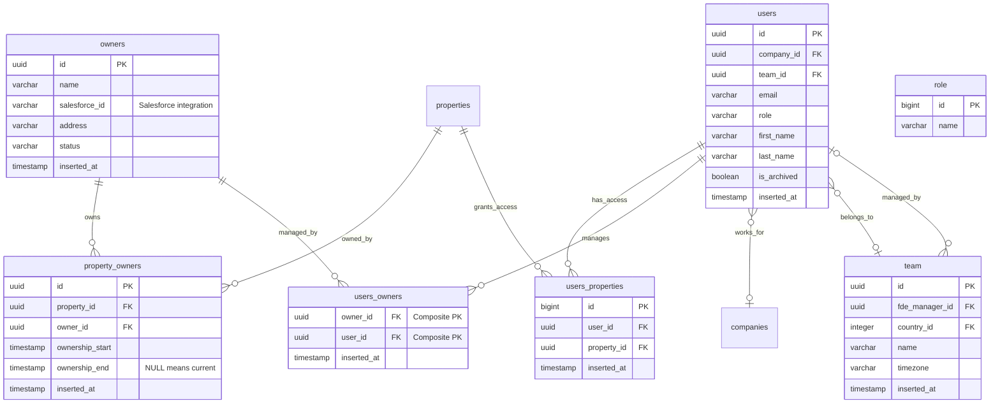
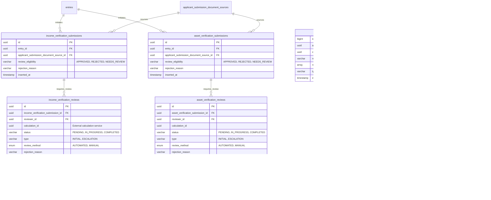

# Entity Relationship Diagrams - Visual Database Schema

**Generated:** 2025-11-25
**Database:** fraud_postgresql (Production)
**Tables Visualized:** 30 tables across 3 major workflows

---

## How to View These Diagrams

These diagrams use Mermaid syntax, which renders automatically in:
- GitHub (when viewing this file in a repository)
- GitLab
- Many markdown editors (VS Code with Mermaid extension)
- [Mermaid Live Editor](https://mermaid.live/) (paste the diagram code)

---

## Table of Contents

1. [Core Entity Model](#1-core-entity-model-14-tables)
2. [Fraud Detection Workflow](#2-fraud-detection-workflow-7-tables)
3. [Verification Workflows](#3-verification-workflows-9-tables)
4. [Complete Integration Overview](#4-complete-integration-overview-30-tables)

---

## 1. Core Entity Model (14 Tables)

**Purpose:** Foundation entities for the entire system - applicants, properties, companies, users, and access control.

### 1.1 Property Hierarchy & Applicant Flow


### 1.2 Ownership & Access Control



---

## 2. Fraud Detection Workflow (7 Tables)

**Purpose:** Document authenticity verification using ML/AI analysis and human review.

### 2.1 Complete Fraud Detection Flow


### 2.2 ML/AI Analysis Details

**Key JSONB Fields in `proof` Table:**

```
extracted_meta (JSONB):
{
  "employer": "Acme Corporation",
  "pay_period_start": "2024-01-01",
  "pay_period_end": "2024-01-15",
  "gross_pay": 3500.00,
  "net_pay": 2650.00,
  "employee_name": "John Smith"
}

meta_data_flags (Array):
["copy_move_forgery", "font_manipulation", "metadata_mismatch"]

similarity_check (Array of JSONB):
[{
  "entry_id": "uuid-123",
  "similarity_score": 0.95,
  "matching_proof_id": "uuid-456"
}]
```

---

## 3. Verification Workflows (9 Tables)

**Purpose:** Income, asset, identity, and rent verification beyond fraud detection.

### 3.1 Income & Asset Verification



### 3.2 Identity & Rent Verification


### 3.3 Third-Party Provider Integration

**Identity Verification Providers:**
- **Incode** (default): Government ID scan + facial recognition + liveness detection
- **Persona**: Alternative identity verification provider

**Rent Verification Providers:**
- **RentTrack**: Rental payment reporting
- **Experian RentBureau**: Rental credit reporting
- **TransUnion ResidentCredit**: Rental history reports

**JSONB Field Examples:**

```
id_verifications.provider_results:
{
  "id_check": {"status": "passed", "document_type": "drivers_license"},
  "face_match": {"status": "passed", "confidence": 98.5},
  "liveness": {"status": "passed", "checks_performed": ["blink", "head_turn"]}
}

rent_verifications.provider_data:
{
  "rental_history": [{
    "address": "456 Oak St",
    "monthly_rent": 1500,
    "payment_history": {"on_time_payments": 34, "late_payments": 2}
  }],
  "evictions": [],
  "overall_rating": "good"
}
```

---

## 4. Complete Integration Overview (30 Tables)

**Purpose:** High-level view showing how all workflows integrate.

### 4.1 Data Flow: Entry Creation to Final Determination


### 4.2 Result Aggregation Logic


### 4.3 User Access Control Model


---

## Diagram Legend

### Relationship Symbols

- `||--o{` : One-to-many (one parent, many children)
- `}o--||` : Many-to-one (many children, one parent)
- `}o--o{` : Many-to-many
- `}o--o|` : Many-to-zero-or-one (optional relationship)

### Table Structure

Each table shows:
- **PK** = Primary Key
- **FK** = Foreign Key
- Key columns with data types
- Important JSONB/array fields
- Enum values in quotes

### Color Coding (in flow diagrams)

- **Pink (#f9f)** = Central/important tables
- **Yellow (#ff9)** = Result/determination tables
- **Red (#f66)** = Rejection/failure states
- **Orange (#fc6)** = Review required states
- **Green (#6f6)** = Approval/success states
- **Blue (#9cf)** = User/access control

---

## Using These Diagrams

### For Developers

1. **Understanding relationships:** Follow the FK arrows to see data flow
2. **Finding dependencies:** See what tables must exist before creating records
3. **Query planning:** Visualize joins needed for complex queries
4. **Feature planning:** See what tables new features will interact with

### For Database Administrators

1. **Schema migrations:** Understand foreign key constraints before altering tables
2. **Performance tuning:** Identify high-traffic join paths
3. **Backup strategies:** Understand table dependencies for backup order
4. **Replication:** See cross-database relationships

### For Product Managers

1. **Feature scope:** Understand data requirements for new features
2. **Integration planning:** See third-party provider integration points
3. **User flows:** Visualize how data flows through verification workflows
4. **Access control:** Understand permission models

### For Data Analysts

1. **Query planning:** See what tables to join for analytics
2. **Metric sources:** Identify tables containing key metrics
3. **Data lineage:** Trace how data flows from entry to final result
4. **Reporting:** Understand aggregation points (folders, entries, results)

---

## Notes on Diagram Accuracy

**These diagrams are based on:**
- Direct schema queries from fraud_postgresql database
- Foreign key constraint analysis
- Business logic documented in workflow files
- Implicit relationships identified during documentation

**Known limitations:**
- Some implicit relationships (not enforced by FK constraints) shown with notes
- JSONB field structures are examples, not exhaustive schemas
- Enum values are representative, not complete lists
- Some intermediate tables may be omitted in flow diagrams for clarity

**For complete details, see:**
- [CORE_ENTITY_MODEL.md](CORE_ENTITY_MODEL.md) - Full schema details
- [FRAUD_DETECTION_WORKFLOW.md](FRAUD_DETECTION_WORKFLOW.md) - Fraud workflow details
- [VERIFICATION_WORKFLOWS.md](VERIFICATION_WORKFLOWS.md) - Verification workflow details
- [README.md](README.md) - Project summary and findings

---

**Generated:** 2025-11-25
**Last Updated:** 2025-11-25
**Version:** 1.0
**Tables Visualized:** 30 of 75 core tables (40% complete)
