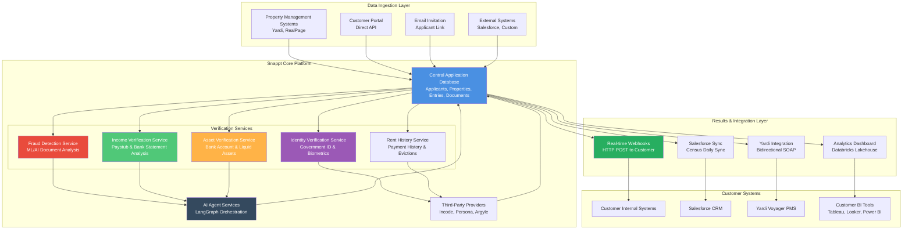
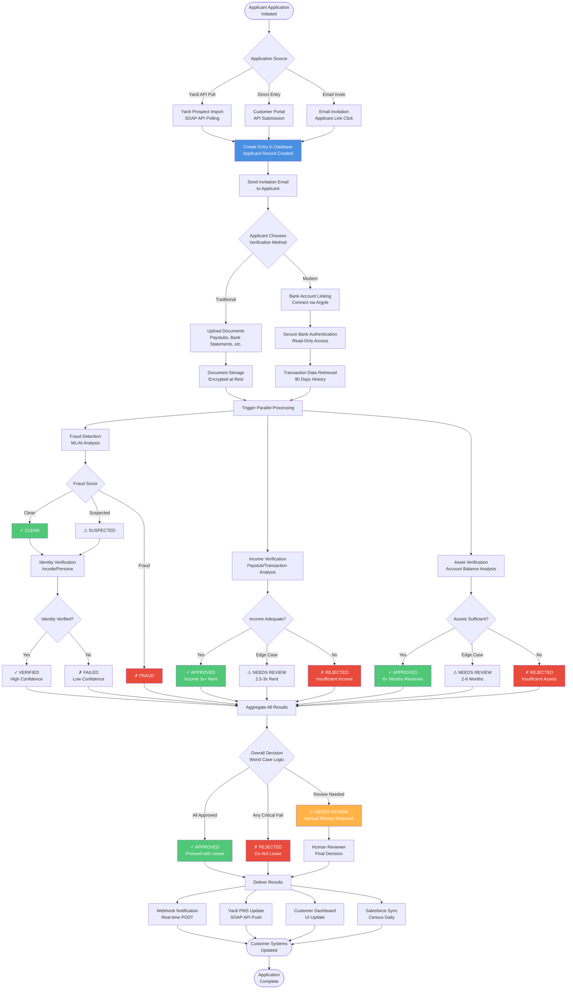
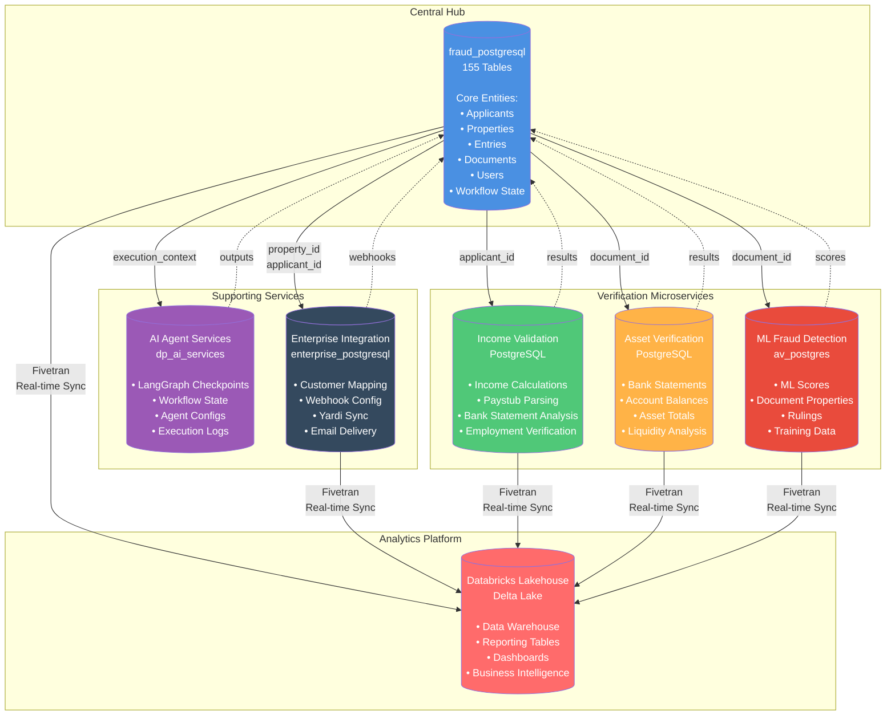
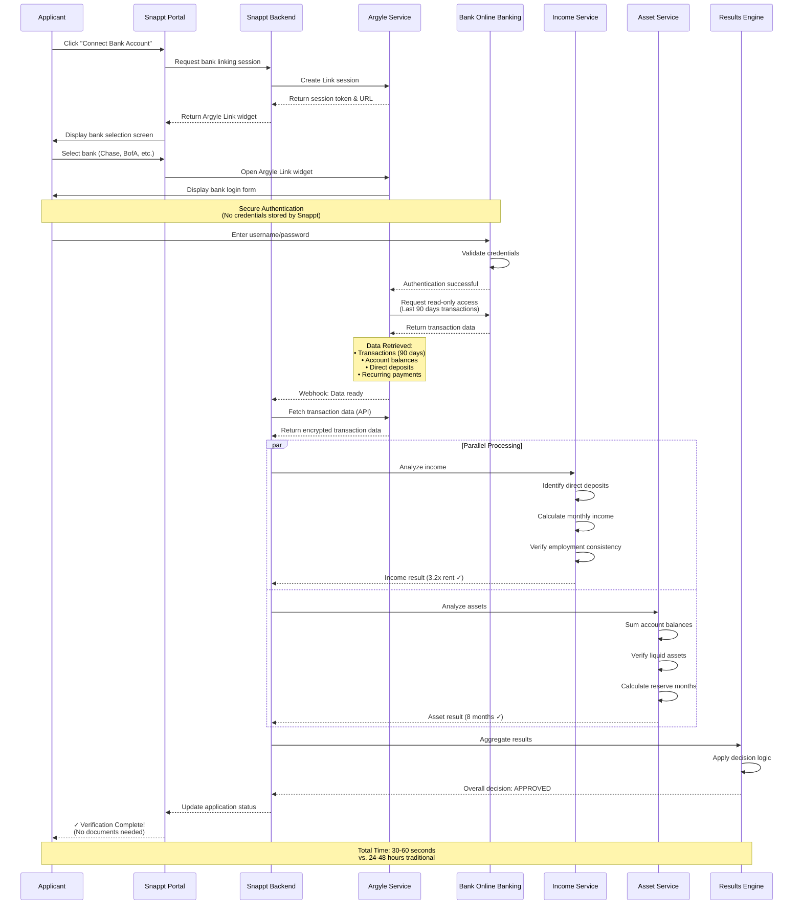
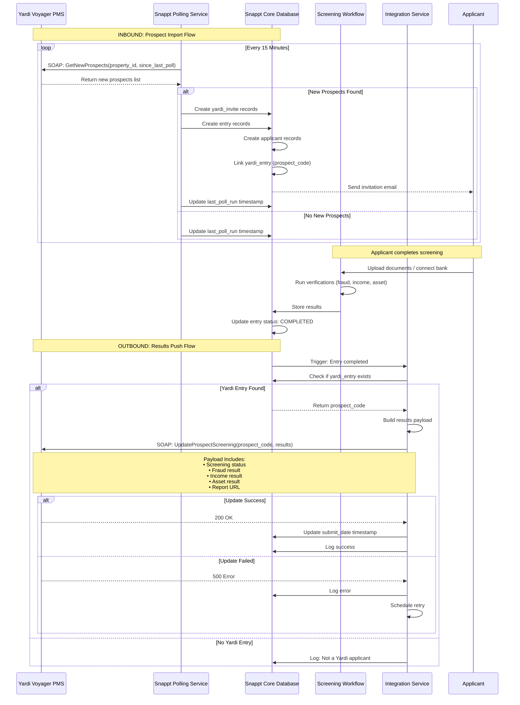
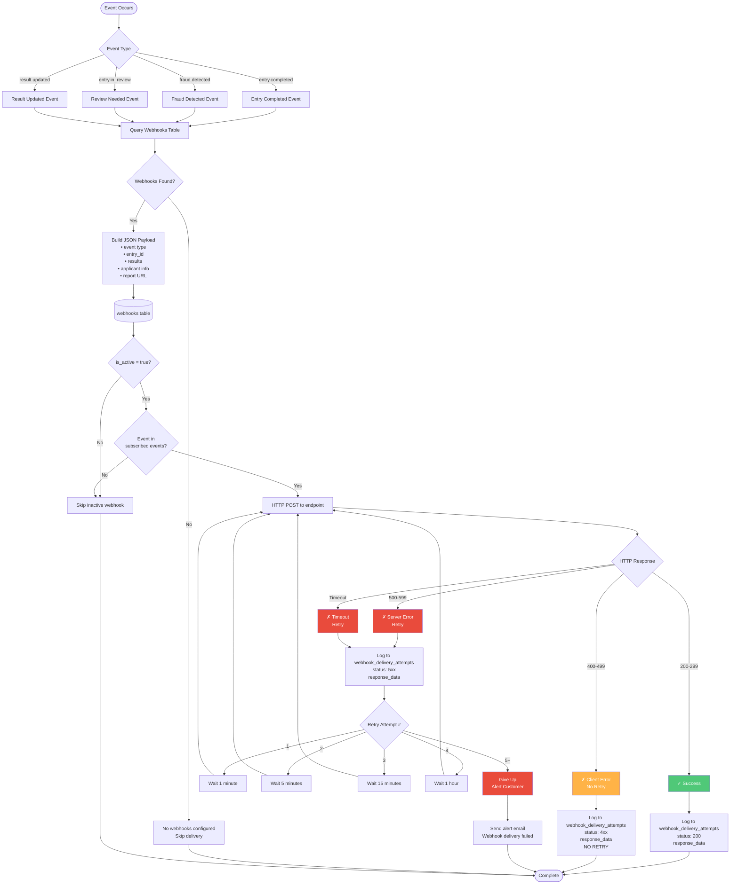
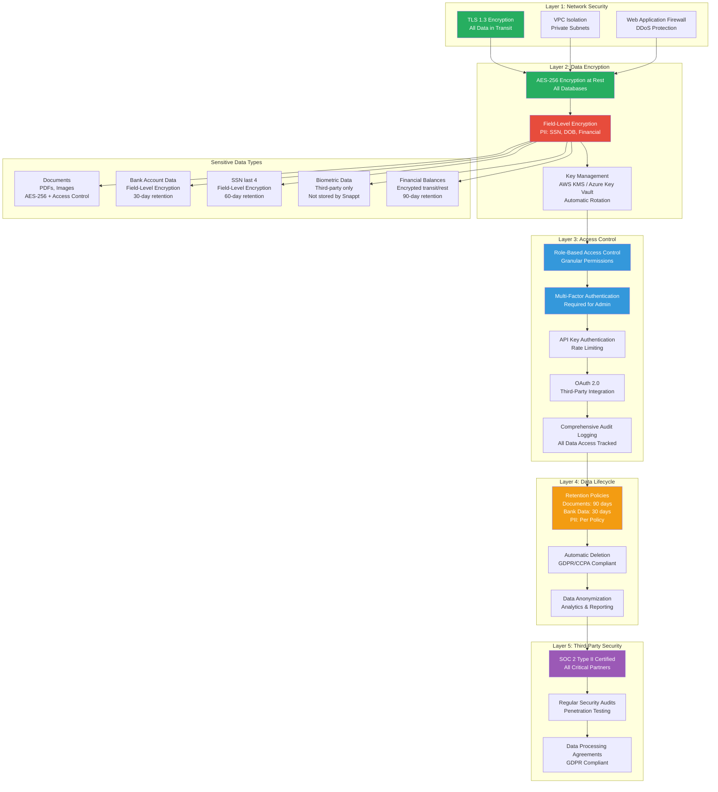
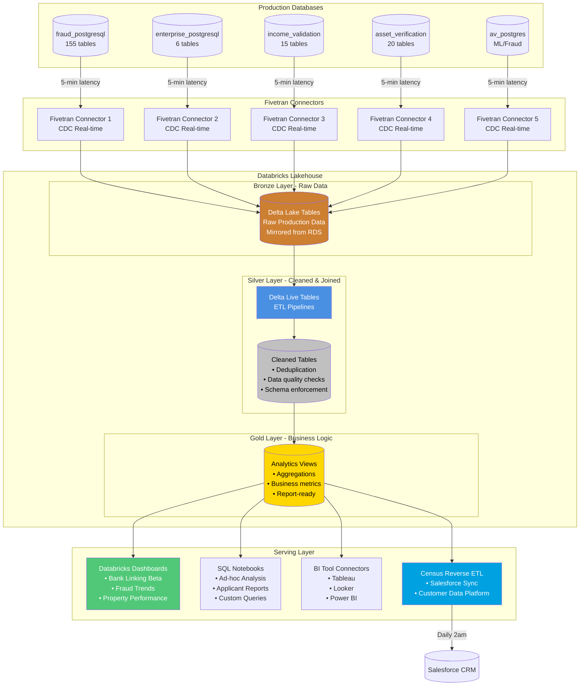
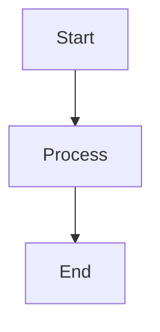

# Snappt Data Flow - Mermaid Diagrams
## Visual Data Flow Architecture

**Last Updated:** December 10, 2025
**Purpose:** Customer-facing visual data flow diagrams using Mermaid

---

## How to View These Diagrams

These Mermaid diagrams can be viewed in:
- **GitHub** - Renders automatically in markdown files
- **Mermaid Live Editor** - https://mermaid.live
- **VS Code** - With Mermaid extension
- **Confluence/Notion** - Many platforms support Mermaid
- **Documentation sites** - MkDocs, Docusaurus, etc.

---

## Diagram 1: High-Level Platform Architecture



---

## Diagram 2: Applicant Verification Journey (Detailed Flow)



---

## Diagram 3: Microservices Database Architecture



---

## Diagram 4: Bank Account Linking Flow (Argyle Integration)



---

## Diagram 5: Yardi PMS Integration (Bidirectional)



---

## Diagram 6: Webhook Delivery System with Retry Logic



---

## Diagram 7: Salesforce Integration via Census

```mermaid
flowchart LR
    subgraph "Source: Snappt RDS"
        RDS[(PostgreSQL<br/>Production Database)]
    end

    subgraph "Fivetran ETL"
        Fivetran[Fivetran Connector<br/>Real-time CDC]
    end

    subgraph "Databricks Data Lakehouse"
        DeltaLake[(Delta Lake Storage<br/>Raw Tables)]
        DLT[Delta Live Tables<br/>Transformation Pipelines]

        Views[Databricks Views<br/>45 Fields Ready]

        DeltaLake --> DLT
        DLT --> Views

        subgraph "Transformed Views"
            NewProps[new_properties_with_features<br/>• Property details 21 fields<br/>• Feature flags 23 fields<br/>• Only properties NOT in Salesforce]

            ProductProps[product_property_w_features<br/>• All active properties<br/>• Feature enablement<br/>• Updated daily]
        end

        Views --> NewProps
        Views --> ProductProps
    end

    subgraph "Census ETL Service"
        CensusModel[Census Model<br/>Connects to Databricks view]
        CensusTransform[Transform & Map<br/>• Field mapping<br/>• Deduplication<br/>• Validation]
        CensusSchedule[Schedule: Daily 2:00 AM]

        CensusModel --> CensusTransform
        CensusTransform --> CensusSchedule
    end

    subgraph "Destination: Salesforce"
        SFAPI[Salesforce Bulk API]
        SFObject[(Product_Property__c<br/>Custom Object)]

        SFAPI --> SFObject
    end

    RDS -->|Real-time Replication| Fivetran
    Fivetran -->|Raw Data| DeltaLake

    NewProps -->|Read| CensusModel
    ProductProps -->|Read| CensusModel

    CensusSchedule -->|Bulk Insert/Update| SFAPI

    SFObject -.->|Query<br/>Check for existing| NewProps

    style RDS fill:#4A90E2,color:#fff
    style DeltaLake fill:#FF6B6B,color:#fff
    style NewProps fill:#50C878,color:#fff
    style SFObject fill:#00A1E0,color:#fff
    style CensusSchedule fill:#FFB347,color:#fff
```



---

## Diagram 8: Data Security & Privacy Architecture



---

## Diagram 9: Analytics Data Flow (Databricks)



---

## Usage Instructions

### To View in GitHub:
1. Upload this file to your GitHub repository
2. GitHub will automatically render the Mermaid diagrams

### To Edit in Mermaid Live Editor:
1. Go to https://mermaid.live
2. Copy any diagram code block (without the backticks)
3. Paste into the editor
4. Customize colors, labels, and structure
5. Export as PNG/SVG for presentations

### To Embed in Documentation:
```markdown
# Your Documentation Page

## Data Flow Diagram


```

### Color Customization Guide:

The diagrams use these colors:
- **Blue (#4A90E2)** - Core systems/databases
- **Green (#50C878)** - Success states/approved
- **Red (#E94B3C)** - Fraud/rejected/errors
- **Orange (#FFB347)** - Warnings/needs review
- **Purple (#9B59B6)** - AI/ML services
- **Dark Gray (#34495E)** - Integration services

To change colors, add style at the bottom of any diagram:
```mermaid
style NodeName fill:#COLOR,color:#fff
```

---

## Diagram Summary

| Diagram # | Name | Best Use Case |
|-----------|------|---------------|
| 1 | High-Level Platform | Executive overview, sales presentations |
| 2 | Applicant Journey | Customer onboarding, process documentation |
| 3 | Database Architecture | Technical architecture reviews, engineering |
| 4 | Bank Linking Flow | Feature demonstrations, integration docs |
| 5 | Yardi Integration | PMS integration documentation |
| 6 | Webhook System | API documentation, integration guides |
| 7 | Salesforce Sync | CRM integration documentation |
| 8 | Security Architecture | Security reviews, compliance audits |
| 9 | Analytics Flow | Data team documentation, BI integration |

---

**For questions or customization requests, contact:** dane@snappt.com
